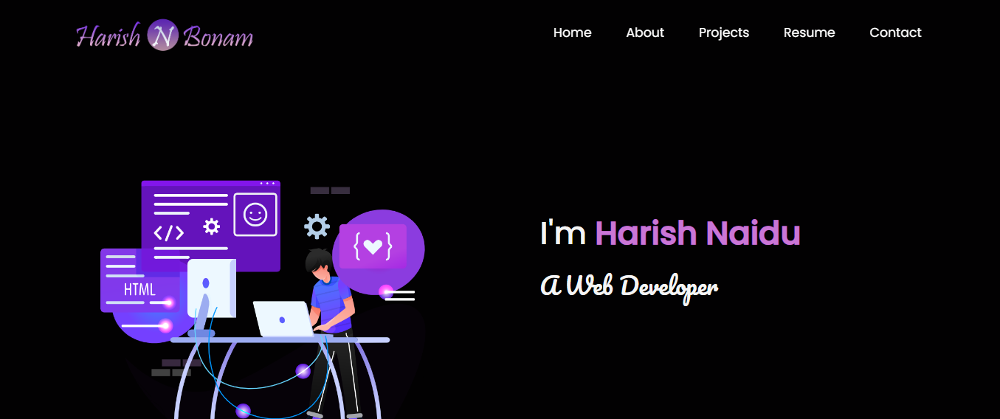

<h2 align="center">
  Portfolio Website - v1.0<br/>
  <a href="https://portfolio-website-react-eta.vercel.app/" target="_blank">Live Website</a>

</h2>

<br/>



## About Project

It is a Protifolio Website developed using following tools & technologies<br/>

- React.js
- Node.js
- CSS3
- VsCode
- Vercel

## Prerequisites

Before running this project, make sure you have the following installed:

- Node.js: [Download and Install Node.js](https://nodejs.org/en/download "Node.js Download")

- git: [Download and Install git globally](https://git-scm.com/ "git Download")

## Installation

Follow these steps to set up the application:

1. Open Powershell/Terminal and Clone the repository to your local machine:

   ```bash
   git clone https://github.com/Harish1611/Portfolio-Website-React.git
   ```

2. Navigate to the project directory:

   ```bash
   cd Portfolio-Website-React
   ```

3. Install the required dependencies:

   ```bash
   npm install or npm i
   ```

4. Run Project Locally:

   ```bash
   npm start
   ```

Runs the app in the development mode.\
Open [http://localhost:3000](http://localhost:3000) to view it in the browser.
The page will reload if you make edits.
